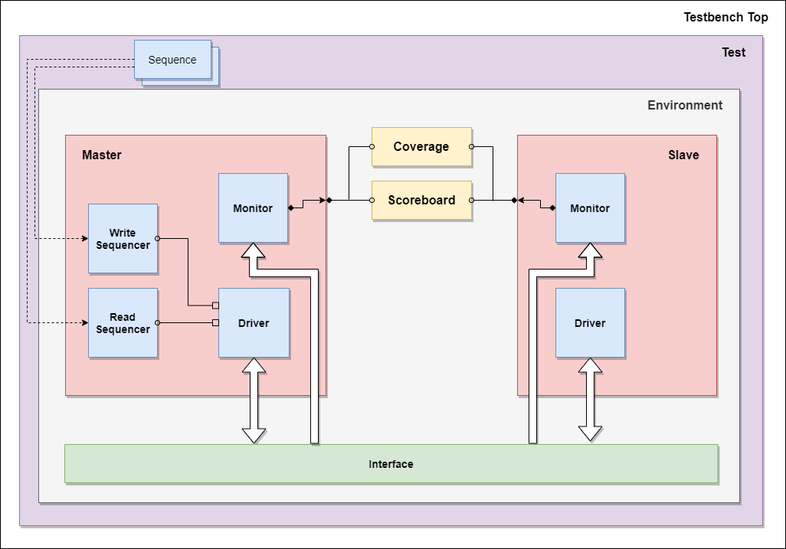

# AXI  

VIP for AXI Protocol

## Architecture

## Components

1. Sequence item
2. Sequence - 2 sequence were made as in AXI read and write can happen in parallel.
3. Sequencer - 2 Sequencer were connected to a single driver so that the read and write operation are independent of each other and can happen in parallel
4. Driver - One each in master and slave
5. Monitor - One each in master and slave
6. Scoreboard
7. Environment
8. Test - Comprises of one base test, and 5 directed test cases.
9. TestBench top - Environment can be configured from here
10. Configuration Object:
    - env_config - Config object to configure the environment and agents
    - test_config - Config object to configure the test.

## How to use

- Download the latest release from below or visit the [release page](https://github.com/kumarrishav14/AXI/releases "Release page") for more old release.
- Copy the contents in a folder.
- Compile *tb_top.sv* in any simulator and simulate *top* module.
- Different test classes can be selected using +UVM_TESTNAME directive.
